# 🦕 DINOCIAL - RPG Social Platform

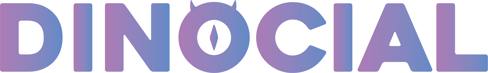

**DINOCIAL** (RPG Social), geleneksel sosyal medya ile RPG oyun mekaniğini birleştiren yenilikçi bir Next.js platformudur. Kullanıcılar seviye atlayarak, görevler tamamlayarak, guild'lere katılarak ve arkadaşlarıyla etkileşim kurarak sosyal bir RPG deneyimi yaşarlar.

## 🎯 Proje Özellikleri

### 🎮 RPG Mekanik Sistemi
- **Karakter Seviyeleri**: 1-100 arası seviye sistemi
- **XP Sistemi**: Sosyal aktivitelerden XP kazanımı
- **6 Farklı Karakter Sınıfı**: Artist, Explorer, Guardian, Sage, Entertainer, Builder
- **Başarım Sistemi**: Rozet ve achievement takibi

### 🏰 Guild Sistemi
- **Guild Oluşturma ve Yönetimi**
- **XP Bonusları**: Guild üyeleri için ekstra XP
- **Collaborative Quests**: Birlikte tamamlanan görevler
- **Guild İstatistikleri**: Detaylı performans takibi

### 🎯 Görev Sistemi
- **Günlük/Haftalık Görevler**
- **Otomatik İlerleme Takibi**
- **XP Ödülleri**: Görev tamamlama bonusları
- **Dinamik İçerik**: Sürekli güncellenen görevler

### 🌍 Harita & Keşif Sistemi
- **Bölge Tabanlı İçerik**
- **Seviye Kapıları**: Belirli seviyede açılan alanlar
- **Keşif Bonusları**: Yeni bölge keşfi ödülleri

## 📱 Özellikler

### 🔐 Güvenli Kimlik Doğrulama
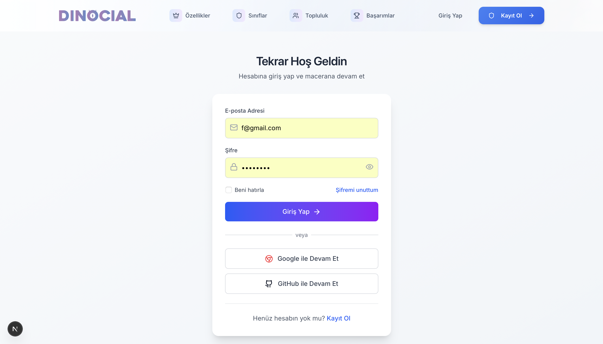
- JWT tabanlı güvenli giriş sistemi
- Google ve GitHub ile sosyal giriş
- Şifre sıfırlama ve güvenlik özellikleri

### 🏠 Ana Sayfa & Dashboard


- Zarif ve modern tasarım
- Responsive arayüz
- Dinozor temalı görsel kimlik

### 📊 Kişisel Dashboard
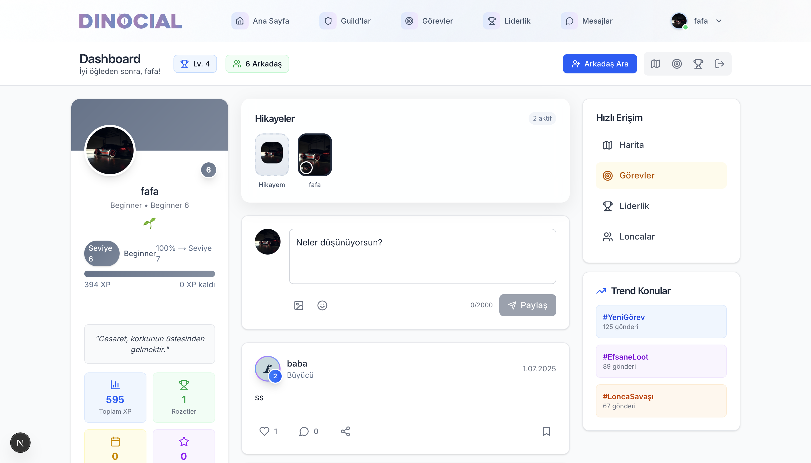
- **Seviye İlerlemesi**: Görsel XP çubukları
- **Hikaye Paylaşımı**: Stories özelliği
- **Arkadaş Sistemi**: Takip et/takip edilme
- **Trend Konular**: Güncel hashtag'ler
- **Kişisel İstatistikler**: Toplam XP, rozetler

### 🎯 Görev Merkezi
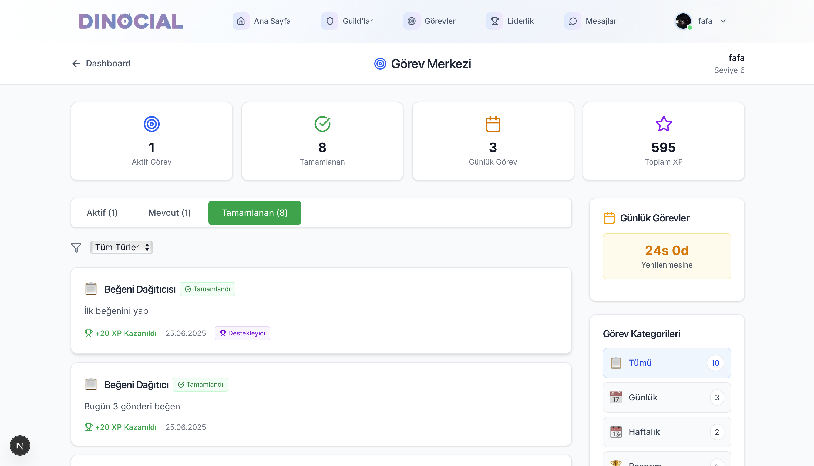
- **Aktif Görevler**: Mevcut görev durumu
- **Tamamlanan Görevler**: Başarı geçmişi
- **Günlük Görevler**: 24s odda sıfırlanan görevler
- **XP Takibi**: Görevlerden kazanılan XP miktarı
- **İlerleme Çubukları**: Görsel görev takibi

### 🏰 Guild Sistemi
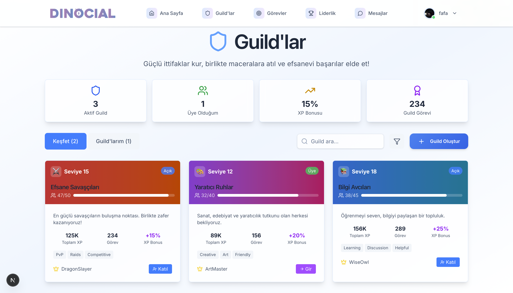
- **3 Aktif Guild**: Farklı temalı loncalar
- **Üye Sayısı**: Guild popülaritesi
- **XP Bonusları**: %15-25 arası XP artırımı
- **Guild İstatistikleri**: Detaylı performans metrikleri
- **Katılım Butonu**: Kolay guild katılımı

### 🏆 Liderlik Tablosu
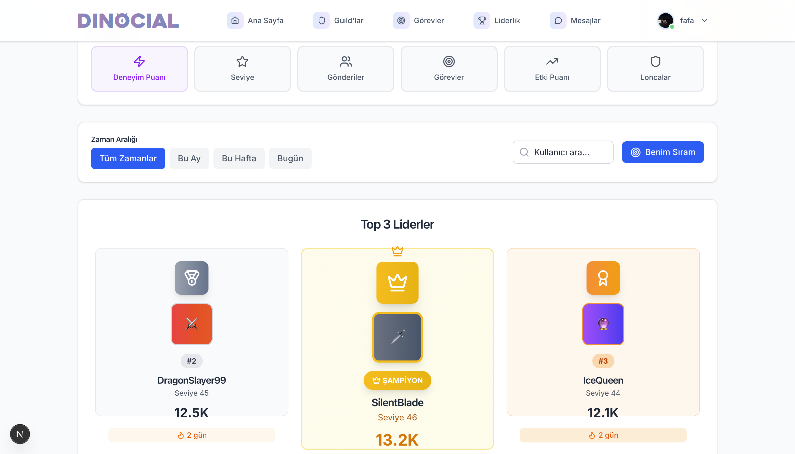
- **Top 3 Liderler**: Şampiyon, 2. ve 3. sıra
- **Seviye Tabanlı Sıralama**: Deneyim puanı sıralaması
- **Karakter Rozetleri**: Farklı sınıf göstergeleri
- **Dinamik Güncelleme**: Gerçek zamanlı sıralama
- **Zaman Filtreleri**: Günlük/haftalık/aylık sıralamalar

### 🗺️ Dünya Haritası
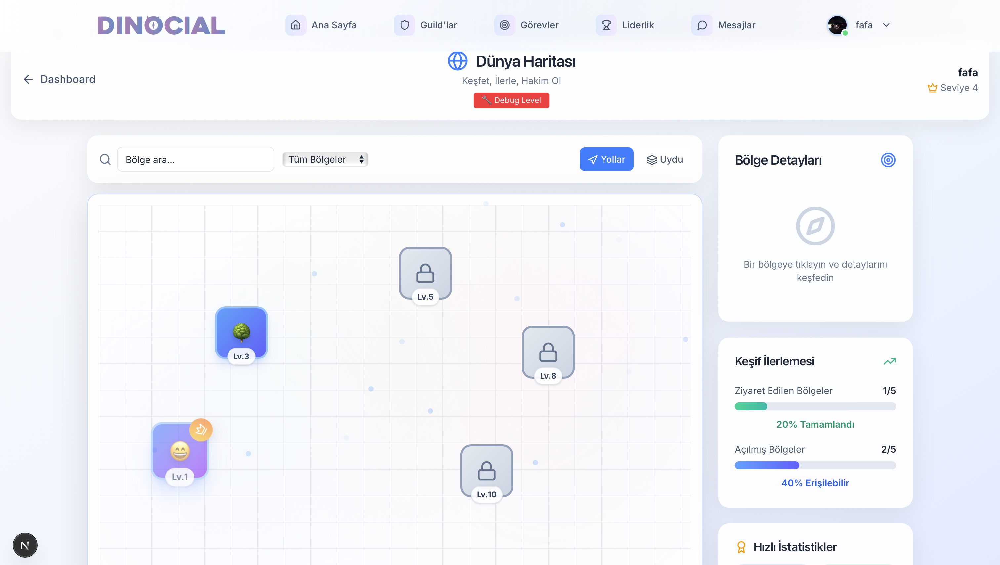
- **Bölge Sistemi**: Farklı seviyelerde açılan alanlar
- **Seviye Kapıları**: Lv.5, Lv.9, Lv.10 gereksinimleri
- **Keşif Sistemi**: Yeni bölgeleri keşfetme
- **Görsel Harita**: Interactive bölge seçimi

### 💬 Gerçek Zamanlı Mesajlaşma
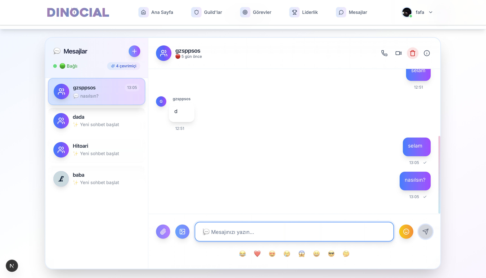
- **Socket.IO Entegrasyonu**: Anlık mesajlaşma
- **Emoji Desteği**: Tam emoji paketi
- **Dosya Paylaşımı**: Resim, video, döküman
- **Typing Indicators**: Yazma göstergeleri
- **Online Durumu**: Kullanıcı aktiflik durumu

### 👤 Profil Yönetimi
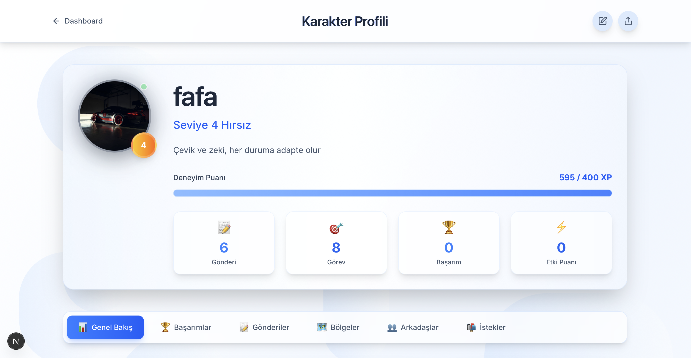
- **Karakter Profili**: Seviye, XP, rozetler
- **İstatistikler**: Gönderiler, görevler, başarımlar
- **Avatar Yönetimi**: Cloudinary entegrasyonu
- **Deneyim Puanı**: 595/400 XP görsel takibi

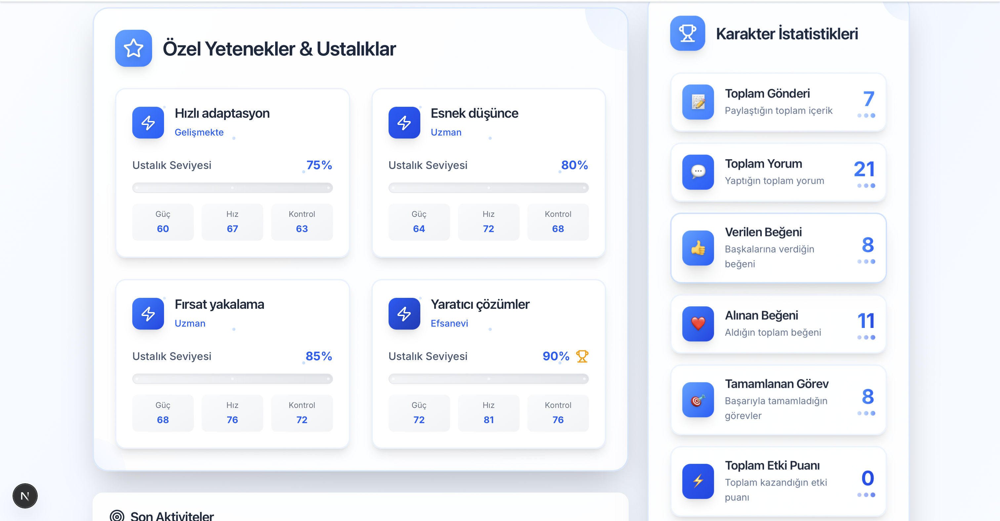
- **Özel Yetenekler**: Hızlı adaptasyon, yaratıcı çözümler
- **Karakter İstatistikleri**: Detaylı performans metrikleri
- **Uzmanlık Seviyeleri**: %75-90 arası başarı oranları
- **Son Aktiviteler**: Güncel eylem geçmişi

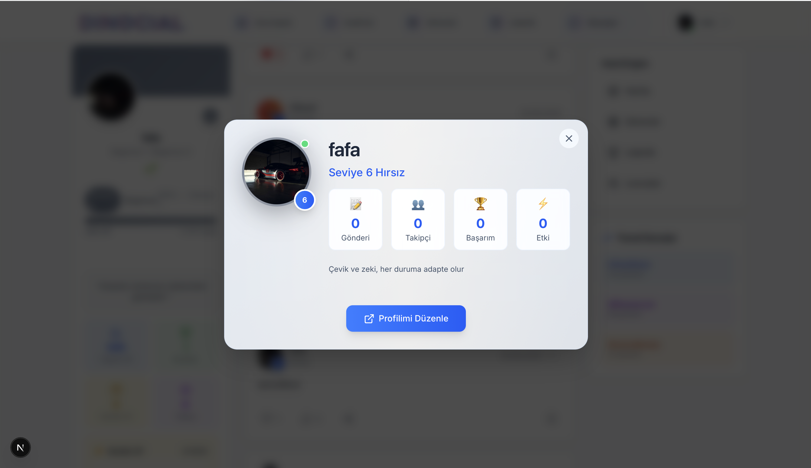
- **Hızlı Önizleme**: Modal popup profil
- **Temel Bilgiler**: Seviye, takipçi, başarım
- **Hızlı Etkileşim**: Profil düzenleme butonu
- **Minimal Tasarım**: Temiz ve kullanıcı dostu

### ⚙️ Ayarlar Sayfası
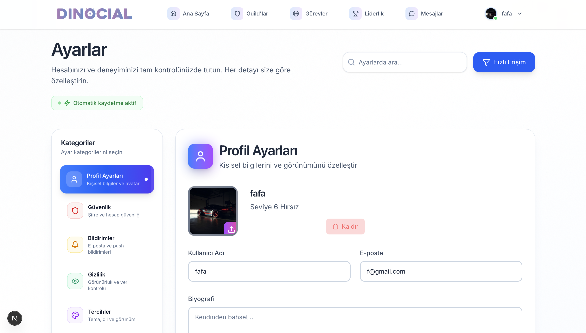
- **Profil Ayarları**: Kişisel bilgi yönetimi
- **Karakter Sınıfı**: 6 farklı sınıf seçimi
- **Gizlilik Kontrolü**: Profil görünürlük ayarları
- **Bildirim Tercihleri**: Özelleştirilebilir bildirimler
- **Hesap Güvenliği**: Şifre ve güvenlik ayarları

### 🔐 NEXUS Admin Panel
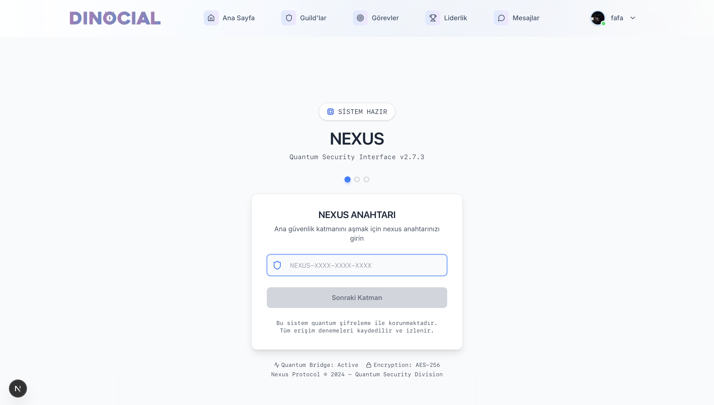
- **Quantum Security Interface**: Gelişmiş güvenlik sistemi
- **NEXUS Anahtarı**: Admin erişim kontrolü
- **Sistem İzleme**: Kapsamlı platform yönetimi
- **Güvenlik Katmanı**: Çok katmanlı doğrulama
- **Professional Tasarım**: Temiz admin arayüzü

## 🛠️ Teknoloji Stack

### Frontend
- **Next.js 15.3.3** - React framework
- **React 19** - Modern React hooks
- **Redux Toolkit** - State management
- **Tailwind CSS 4.1.8** - Utility-first styling
- **Framer Motion** - Animations
- **Lucide React** - Modern icons

### Backend
- **Custom Node.js Server** - Socket.IO entegrasyonu
- **Socket.IO 4.8.1** - Real-time communication
- **MongoDB + Mongoose** - Database
- **JWT Authentication** - Secure auth
- **Cloudinary** - Image management
- **bcryptjs** - Password hashing

### Real-time Features
- **Socket.IO Server** - WebSocket connections
- **User Presence** - Online/offline tracking
- **Typing Indicators** - Real-time typing status
- **Message Delivery** - Instant message sync
- **Live Updates** - Real-time data updates

## 🚀 Kurulum

### 1. Proje Klonlama
```bash
git clone https://github.com/USERNAME/rpg-social.git
cd rpg-social
```

### 2. Bağımlılıkları Yükle
```bash
npm install
```

### 3. Environment Variables
```bash
cp .env.example .env.local
# .env.local dosyasını düzenle
```

### 4. Geliştirme Sunucusu
```bash
npm run dev
```

### 5. Production Build
```bash
npm run build
npm start
```

## 🎨 Tasarım Özellikleri

### 🎨 Görsel Kimlik
- **Dinozor Teması**: Eğlenceli ve modern
- **Mor-Mavi Gradient**: Premium görünüm
- **Minimalist İkonlar**: Lucide React icon set
- **Responsive Design**: Tüm cihazlarda mükemmel

### 🎯 UX/UI Özellikleri
- **Smooth Animations**: Framer Motion
- **Loading States**: Kullanıcı dostu yükleme
- **Error Handling**: Comprehensive error management
- **Dark/Light Mode**: Tema desteği hazır
- **Accessibility**: ARIA labels ve keyboard navigation

## 🔧 Özellikler

### 🔐 Güvenlik
- **JWT Token**: Secure authentication
- **Rate Limiting**: API abuse protection
- **Input Validation**: Yup schema validation
- **CORS Policy**: Secure cross-origin requests
- **Environment Security**: Sensitive data protection

### 📊 Analytics
- **User Activity**: Comprehensive tracking
- **Quest Progress**: Detailed quest analytics
- **Guild Performance**: Guild statistics
- **Leaderboard**: Real-time rankings
- **Social Metrics**: Engagement tracking

### 🎮 Gaming Features
- **XP System**: Experience points from activities
- **Level Progression**: 1-100 level system
- **Achievement System**: Badges and rewards
- **Region System**: Unlockable areas
- **Character Classes**: 6 unique classes

## 🌟 Gelecek Özellikler

### 🚀 Roadmap
- [ ] **Mobile App**: React Native version
- [ ] **Push Notifications**: Real-time alerts
- [ ] **Voice Chat**: In-guild voice rooms
- [ ] **AI Chatbot**: Intelligent quest helper
- [ ] **NFT Integration**: Blockchain achievements
- [ ] **Multi-language**: Global localization

### 🎯 Planned Features
- [ ] **Tournament System**: Competitive events
- [ ] **Marketplace**: In-game item trading
- [ ] **Streaming Integration**: Twitch/YouTube
- [ ] **Advanced Analytics**: Deep insights
- [ ] **API Ecosystem**: Third-party integrations

## 📞 İletişim

- **Developer**: [@murad](https://github.com/murad)
- **Project**: [RPG Social](https://github.com/murad/rpg-social)
- **Demo**: [Live Demo](https://rpg-social.vercel.app)
- **Docs**: [Documentation](./CLAUDE.md)

## 📄 Lisans

Bu proje MIT lisansı altında lisanslanmıştır. Detaylar için [LICENSE](./LICENSE) dosyasına bakın.

---

**DINOCIAL** - *Sosyal medyanın efsanevi hali* 🦕✨

*Geliştirici: Murad Eyvazli*  
*Teknoloji: Next.js, Socket.IO, MongoDB*  
*Tema: RPG + Social Media*  
*Yıl: 2024*